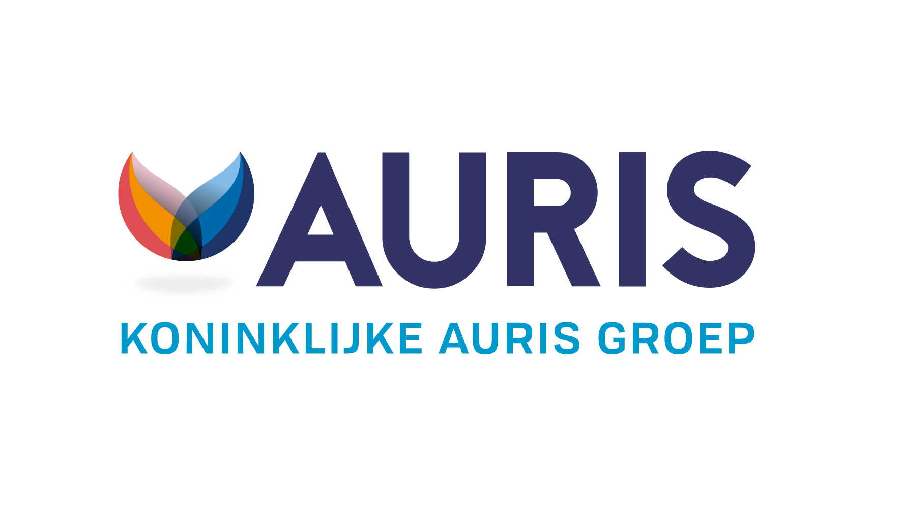
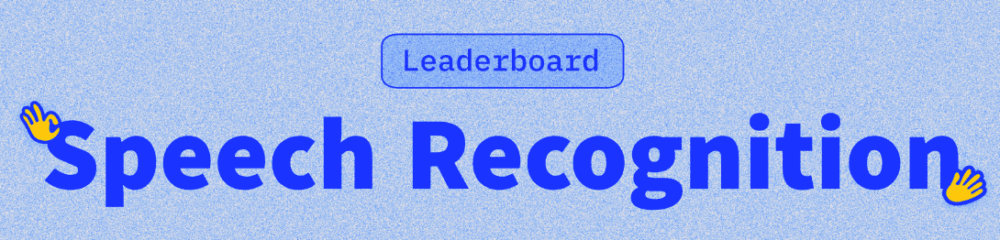

# Auris ASR Benchmark

This project attempts to create a benchmark for Automatic Speech Recognition (ASR) models and their performance of recognizing Dutch child speech. Evaluated through Word Error Rate and Inverse real time factor metrics 

## Auris Group

The organization at the heart of this project is the [Koninklijke Auris Groep](https://auris.nl/). Auris is one of the leading institutions in the Netherlands specializing in language, speech, and hearing. 
They provide comprehensive services—including diagnosis, treatment, support, and education—tailored to the specific needs of each client.When necessary, these services are delivered at one of Auris’s dedicated treatment or educational centers.

Among its many initiatives, the [Innovation team](https://auris.nl/innovatie/) at Auris is actively involved in developing language tools to optimize the diagnosis and treatment process. 
The benchmark project presented here represents a small  in this broader mission. By evaluating the performance of state-of-the-art automatic speech recognition (ASR) models 
on Dutch child speech—both from typically developing children and those with developmental language disorders - we aim to promote the ethical and responsible inclusion of child speech data in ASR training. 
Our hope is to contribute to the development of more inclusive and effective speech technologies, with benefits for the healthcare and education sectors.

## Open ASR Leaderboard: State of the arts 

## Documentation

## UI - Hugging Face Spaces and Gradio

## Authors

- [@bchiusano](https://github.com/bchiusano)

## Acknowledgements

 - [Open ASR Leaderboard GitHub Repository](https://github.com/huggingface/open_asr_leaderboard)
 - [ESB Paper](https://arxiv.org/abs/2210.13352)

